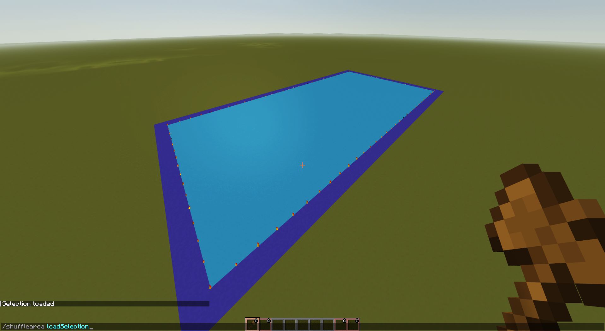
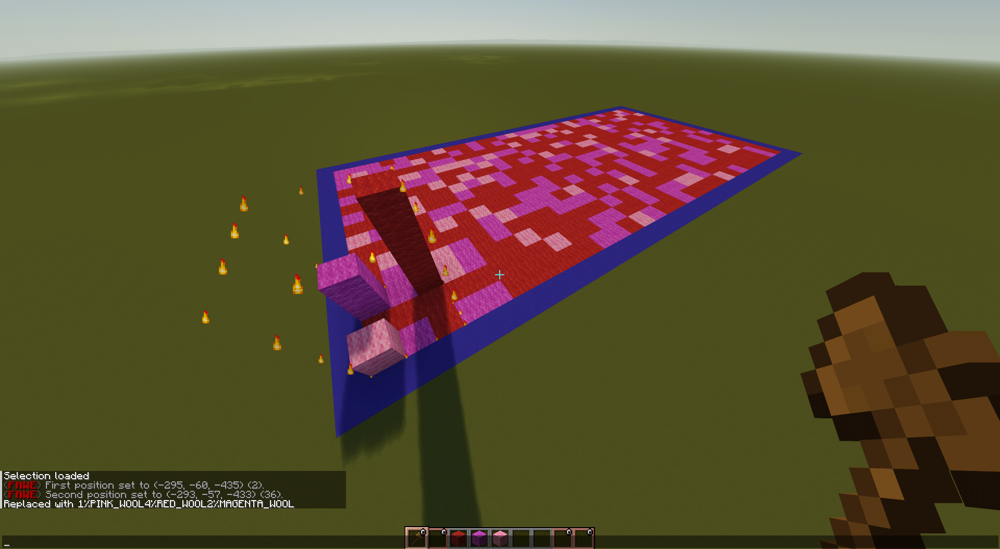
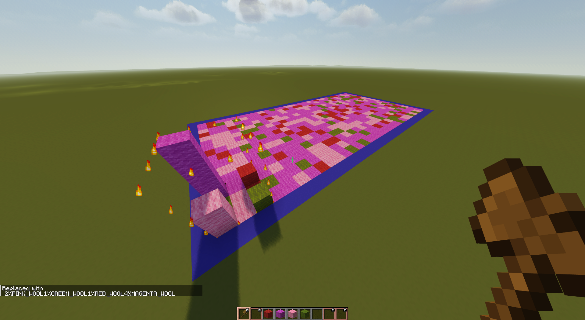

# ShuffleArea
Extension for world edit. Randomly maps blocks from one selection onto another.

### Plugin extends world edit and adds one command:

`/shufflearea`

The command takes one argument `[clear|loadSelection|replaceWith|reshuffle]`

`/shufflearea clear` clears plugins internal buffer \
`/shufflearea loadSelection` loads current world edit selection into internal buffer \

`/shufflearea replaceWith` fills loaded selection with randomly selected blocks form current selection \

`/shufflearea reshuffle` reshuffles blocks on loaded selection